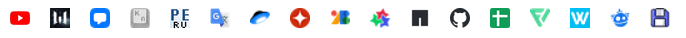
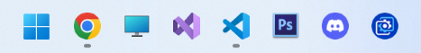

# Настройка после переустановки

- [Настройка Windows](#настройка-windows)
  - [Установка Windows 11 через флешку](#установка-windows-11-через-флешку)
    - [Создание установочного носителя](#создание-установочного-носителя)
    - [Установка Windows](#установка-windows)
    - [Настройка Windows](#настройка-windows-1)
  - [Настроить Google Chrome](#настроить-google-chrome)
  - [Настроить VS Code](#настроить-vs-code)
  - [Скачивание программ](#скачивание-программ)
  - [Настройка оформления Windows](#настройка-оформления-windows)

<a id="настройка-windows"></a>

# Настройка Windows

<a id="установка-windows-11-через-флешку"></a>

## Установка Windows 11 через флешку

<a id="Созданиеустановочногоносителя"></a>

### Создание установочного носителя

<a id="УстановкаWindows"></a>

### Установка Windows

1. Через "BIOS" откройте "Boot Menu" (на фото пример с Lenovo IP Gaming 3)  
2. В открывшемся меню выбираем флешку с Windows (здесь выбирается флешка "EFI USB Device (General USB Flash Disk)")  
3. Затем откроется меню установщика Windows, где нужно выбрать нужные языки и нажать кнопку "Далее"  
4. В открывшемся окне нажмите на кнопку "Установить"  
5. В окне с активацией Windows жмете на кнопку "У меня нет ключа продукта"  
6. Выбираете операционную систему, которую хотите установить и нажимаете на кнопку "Далее"  
7. Принимаете соглашение и нажимаете на кнопку "Далее"  
8. Выбираете тип установки "Выборочная: только установка Windows (для опытных пользователей)"  
9. Форматируете все диски нажатием на нужный диск, а затем на кнопку "Форматировать"   
10. Сочетанием клавишь "Shift + F10" (для некоторых ноутбуков "Shift + Fn + F10"), запускаете командную строку   
11. В консоли вводите команду "diskpart" и нажимаете клавишу "Enter"   
12. В консоли вводите команду "list disk" и нажимаете клавишу "Enter"   
13. В консоль выведутся все диски компьютера (в моем случае диск с 476 гигабайтами, на который будет установлена Windows и диск на 14 гигабайт, на котором находится установщик Windows). Найдите номер диска, на который хотите установить Windows (в моем случае это "0"). В консоль введите команду "select disk N", где N - это номер диска (в моем случае было введено "select disk 0"). Нажмите клавишу "Enter"   
14. Введите в консоль "clean" и нажмите клавишу "Enter"   
15. Закройте консоль нажав на красный крестик в правом верхнем углу
16. Нажмите на кнопку "Обновить"
17. После проделанных действий диск будет полностью отформатирован, с диска будут удалены ненужные директории. Нажмите на кнопку "Далее"
18. После этого начнется установка Windows. Дождитесь, когда Windows будет установлена 

<a id="НастройкаWindows"></a>

### Настройка Windows

1. Выберете страну и нажмите на кнопку "Да"  
2. Выберете раскладку клавиатуры и нажмите на кнопку "Да"  
3. В открывшемся окне нажмите на кнопку "Пропустить"  
4. Подключитесь к нужному Wifi и нажмите на кнопку "Далее"  
5. Нажмите кнопку "Пока пропустить"  
6. В разделе "Выбор способа настройки устройства" выберете пункт "Настроить для личного использования"  
7. Нажмите кнопку "Войти"  
8. Введите адрес электронной почты и нажмите кнопку "Далее"  
9. Введите пароль и нажмите кнопку "Вход"  
10. Снова введите адрес электронной почты и нажмите кнопку "Далее"  
11. Введите код безопасности, который пришел вам на почту и нажмите кнопку "Далее"  
12. Нажмите на кнопку "Создать ПИН-код"  
13. Введите ПИН-код и нажмите на кнопку "Ок"  
14. Снимите все галочки на странице "Выберете параметры конфиденциальности для этого устройства" и нажмите кнопку "Принять"  
15. Нажмите на кнопку "Пропустить"  
16. Нажмите на кнопку "Пропустить"  
17. Дождитесь загрузки Windows  
18. После проделанных действий откроется рабочий стол Windows

<a id="НастроитьGoogleChrome"></a>

## Настроить Google Chrome

* Установить Chrome [[Скачать](https://www.google.ru/intl/ru/chrome/)]
* Войти в аккаунт an...ir@gmail.com
* Удалить аккаунт Гость
* Сделать браузер по умолчанию 
    * Параметры
    * Приложения
    * Приложения по умолчанию
    * Google Chrome
    * Сделать браузером по умолчанию
* Добавить панель закладок 
    * Открыть настройки в Chrome 
    * Внешний вид
    * Панель закладок
* Добавить все нужные закладки  
  
* Зайти во все аккаунты на сайтах в закладках
* Скачать расширение для rutracker.org [[Скачать](https://chrome.google.com/webstore/detail/%D0%B4%D0%BE%D1%81%D1%82%D1%83%D0%BF-%D0%BA-%D1%80%D1%83%D1%82%D1%80%D0%B5%D0%BA%D0%B5%D1%80%D1%83/lbdmhpkmonokeldelekgfefldfboblbj/related?hl=ru)]
* Скрыть ярлыки на главной
    * На главной странице нажать "Настроить Chrome" (в правом нижнем углу)
    * Ярлыки
    * Скрыть ярлыки
* Изменить путь загрузки на рабочий стол
    * Открыть настройки в Chrome
    * Скачанные файлы
* Убрать черную полосу с сылками снизу экрана
    * Открыть настройки в Chrome
    * Система
    * Убрать галочку с пункта "Использовать аппаратное ускорение (при наличии)"
    * Перезапустить

<a id="настроить-vs-code"></a>

## Настроить VS Code

* Поменять язык
	* Ctrl + Shift + P
	* Ввести "Configure Display Language"
	* Выбрать "русский"
* Отключить появление уведомлений "Разрешить ненадежные файлы в этом окне?"
	* Настройки в левом нижнем углу
	* Параметры
	* Найти "security.workspace.trust.enabled"
	* Убрать галочку
* Отключить появление приветствия при запуске
	* Настройки в левом нижнем углу
	* Параметры
	* Найти "workbench.startupEditor"
	* Поставить "none"
* Отключить автоматическое открытие проектов при повторном запуске
	* Настройки в левом нижнем углу
	* Параметры
	* Найти "window.restoreWindows"
	* Поставить "none"
* Убрать желтое выделение
	* Настройки в левом нижнем углу
	* Параметры
	* Найти "Unicode Highlight: Non Basic ASCII"
	* Поставить "false"
* Убрать "Компактные папки"
	* Настройки в левом нижнем углу
	* Параметры
	* Найти "Explorer: Compact Folders"
	* Поставить "false"
* Расширения
	* Auto Rename Tag
  	* CSS Var Complete
  	* Database Client JDBC
	* Easy icon theme
	* ES7+ React/Redux/React-Native snippets
	* ESLint
	* Git Graph
	* Git Lens 
	* Image preview
	* Import Cost
  	* JavaScript (ES6) code snippets
  	* Live Server
	* Markdown All in One
	* markdownlint
   	* OpenAPI (Swagger) Editor
	* Prettier - Code formatter
	* Remote - SSH
 	* Sort lines
  	* Svg Preview
* Сниппеты (ReactJS.code-snippets)

<a id="скачивание-программ"></a>

## Скачивание программ

* Adobe Photoshop CS6  
    * Поменять размерность на пиксели
        * Нажать Ctrl + R
        * Нажать ПКМ на открывшейся линейке
        * Выбрать пиксели
    * Поменять размерность при создании
        * Нажать Ctrl + N
        * Поменять размер ширины и высоты на пиксели
        * Ввести новую ширину и высоту
* Aida 64
* Bandicam
* Blue Stacks [[Скачать](https://www.bluestacks.com/ru/index.html)]
* Compass 3D
    * Открыть папку KOMPAS-3D v21 x64
    * Установить при помощи Setup.exe
    * Открыть папку "!Crack!"
    * Открыть архив "Base_21.0.0_x64_noHASP_2022.07.30"
    * В архиве лежать папки
    * Нужно перейти к файлам в корень каждой из папок
    * Файлы нужно перенести в соответствующие папки в компасе
    * Запустить компас
* CpuZ [[Скачать](https://cpu-z.ru.uptodown.com/windows)] 
* CS GO [   [Скачать](https://store.steampowered.com/app/730/CounterStrike_Global_Offensive/)]
* Da Vinci Resolve [[Скачать](https://www.blackmagicdesign.com/products/davinciresolve)]
* Desk Pins [[Скачать](https://deskpins.softonic.ru/)]
    * Запустить после установки
    * Поменять сочетание клавишь активации окна
        * Правой кнопкой мыши на DeskPins
        * Options...
        * Hotkeys
        * Toggle active window pin
        * Поменять на Ctrl + F10
* Discord [[Скачать](https://discord.com/)]
    * Войти в аккаунт an...ir@gmail.com
* Docker [[Скачать](https://www.docker.com/)]
    * Скачать Ubuntu в Microsoft Store
    * Запустить установщик Docker
* Epic Games [[Скачать](https://www.epicgames.com/store/ru/)]
    * Войти в аккаунт...
* Explorer Patcher [[Скачать](https://github.com/valinet/ExplorerPatcher/releases/tag/22621.1555.55.1_a95a688)]
    * Установить
    * Нажать на панель задач ПКМ и выбрать "Свойства"
    * В пункте "TaskBar" выбрать "TaskBar style : Windows 11"
    * В пункте "Start Menu" поставить галочку у "Disable the Recommended section" 
    * В левом нижнем углу нажать на "Restart File Explorer"
* Firefox
* Git [[Скачать](https://git-scm.com/downloads)]
* Inno Setup [[Скачать](https://jrsoftware.org/isdl.php)]
* Logi Options+ [[Скачать](https://www.logitech.com/en-ph/software/logi-options-plus.html)]
* Minecraft [[Скачать не официально](https://tlauncher.org/)]
* Mini Bin [[Скачать](https://minibin.ru.uptodown.com/windows)]
* MobaXterm
* Mp3tag [[Скачать](https://www.mp3tag.de/en/download.html)]
* Msi Afterburner [[Скачать](https://ru.msi.com/page/AFTERBURNER)]
* Node JS [[Скачать](https://nodejs.org/en)]
    * Перейти по пути "C:\Users\R\AppData\Roaming"
    * Создать папку "npm"
* NotePad++ [[Скачать](https://notepad-plus-plus.org/downloads/)]
* OBS [[Скачать](https://obsproject.com/ru)]
* OneDrive
* Opera GX
* Postman
* PowerToys
	* Включить эти функции
 		* Изменение размера изображений
   		* Обзор
     	* Расширенная вставка
      	* Цветоподборщик
      	* File Locksmith
      	* PowerRename 
* PyCharm [[Скачать](https://www.jetbrains.com/ru-ru/)]
* Python [[Скачать](https://www.python.org/downloads/)]
* QBitTorrent [[Скачать](https://www.fosshub.comqBittorrent.html)]
* QTTapBar [[Скачать](http://qttabbar.wikidot.com/)]
* Resource Hacker [[Скачать](http://www.angusj.com/resourcehacker/)]
* SD Card Formatter [[Скачать](https://www.sdcard.org/downloads/formatter/)]
* ShareX [[Скачать](https://getsharex.com/)]
    * Запустить приложение
    * Поменять папку со скриншотами
        * Настройки приложения
        * В открывшемся окне "Каталоги"
        * Нажать на галочку "Пользовательская папка для скриншотов"
        * Нажать "Обзор" и выбрать нужную папку
    * Изменить задачи после захвата
        * На главной странице нажать на "Задачи после захвата"
        * Выбрать пункты
            * Открыть в редакторе изображений
            * Скопировать изображение в буфер обмена
            * Сохранить изображение в файл
    * Горячие клавиши
        * На главной нажать на "Горячие клавиши"
        * В открывшемся окне дать все разрешения
* SketchUP
* Steam [[Скачать](https://store.steampowered.com/?l=russian)]
    * Войти в аккаунт t...a1 с почтой an...ir@gmail.com
* Sublime Text [[Скачать](https://www.sublimetext.com/download)]
* Telegram [[Скачать](https://desktop.telegram.org/?setln=ru)]
* Vegas Pro 17 [[Скачать](https://www.sublimetext.com/download)]
    * Запустить setup.exe
    * Указать папку установки
    * После установки не запускать файл
    * Открыть файл activation.exe
    * В разделе, в котором нужно указать папку, ввести в ручную папку, в которую была установлена программа
* Visual Studio [[Скачать](https://visualstudio.microsoft.com/ru/)]
* Visual Studio Code [[Скачать](https://code.visualstudio.com/)]
* Virtual Box
* Wallpaper Engine [[Скачать](https://store.steampowered.com/app/431960/Wallpaper_Engine/)]
* Warface [[Скачать](https://ru.warface.com/)]
* Windows Terminal [Скачать в Microsoft Store]
    * Назначить терминалом по умолчанию
        * Параметры
        * Запуск
        * Приложение терминала по умолчанию
        * Установить "Терминал Windows"
    * Поменять оформление
        * Параметры
        * По умолчанию
        * Оформление
        * Цветовая схема: One Half Dark
        * Прозрачность: 88
        * Включить акриловый материал 
* WinRar
* WinSCP
* WireGuard [[Скачать](https://www.wireguard.com/)]
* Wiz Tree [[Скачать](https://diskanalyzer.com/)]
* Yandex
* Zoom [[Скачать](https://zoom.us/download)]

<a id="НастройкаоформленияWindows"></a>

## Настройка оформления Windows

* Изменить панель задач
    1. Открыть настройки параметров
        * Персонализация
        * Панель задачи
    2. Отключить
        * Поле поиска
        * Представление задач
        * Мини-приложения
        * Чат
    3. Включить только дополнительные значки
        * DeskPins
        * MiniBin
    4. Переместить панель в центр
        * Поведение панели задач
        * Выравнивание панели : слева
    5. Оставить только значки
    
* Изменить пуск
    * Открепить от начального экрана все приложения
    * Изменить настройки
        * Параметры
        * Персонализация
        * Пуск
        * Оключить
            * Показ приложений
            * Показ предложений
        * Включить
            * Открывать пуск в полноэкранном режиме
    * Добавить все нужные приложения
* Убрать "Рекомендации" из меню пуск
    * Создать файл .reg
    * Вписать в файл код
    ```
    Windows Registry Editor Version 5.00

    [HKEY_LOCAL_MACHINE\SOFTWARE\Microsoft\PolicyManager\current\device\Start]
    "HideRecommendedSection"=dword:00000001

    [HKEY_LOCAL_MACHINE\SOFTWARE\Microsoft\PolicyManager\current\device\Education]
    "IsEducationEnvironment"=dword:00000001

    [HKEY_LOCAL_MACHINE\SOFTWARE\Policies\Microsoft\Windows\Explorer]
    "HideRecommendedSection"=dword:00000001
    ```
    * Запустить файл
    * Перезагрузить компьютер
* Изменить обои
* Перекинуть с флешки все старые файлы
* Поменять открытие "Проводника" на открытие "Этого компьютера"
    * Открыть проводник
    * Нажать на 3 точки (Подробнее)
    * Параметры
    * В новом окне выбрать вкладку общие
    * В разделе "Открыть проводник для" установить значение "Этот компьютер"
* Отключить автоматический запуск приложений
    * Диспетчер задач
    * Автозагрузка приложений
* Отключить уведомления
    * Система
    * Уведомления
* Показывать расширения файлов
* Отключить анимации
    * Зайти в этот компьютер
    * Свойства
    * Дополнительные параметры
    * Быстродействие
* Открепить от рабочего стола корзину
    * Параметры
    * Персонализация
    * Темы
    * Параметры значков рабочего стола
* Выключить автоматическое погасание экрана
    * Панель управления
    * Оборудование и звук
    * Электропитание
    * Настройка отключения дисплея
* Поставить выключение на кнопку
    * Панель управления
    * Оборудование и звук
    * Электропитание
    * Действия кнопок питания
* Поменять букву диска
    * Нажать Win + R
    * Ввести diskmgmt.msc
* Выйти с учетной записи Microsoft
    * Параметры
    * Учетная запись
    * Ваши данные
    * Выйти из учетной записи
* Поменять тему Windows	
    * Параметры
    * Персонализация
    * Цвета
    * Выбор цвета
* Поменять время
* Поменять имя администратора
    * Панель управления
    * Учетные записи пользователей
    * Учетные записи пользователей
    * Изменение имени своей учетной записи
    * Ввести "⠀"
* Добавить "Этот компьютер" на панель задач
    1. На рабочем столе нажать ПКМ и выбрать "Создать -> Ярлык"
    2. Указать в расположении объекта explorer.exe "::{20D04FE0-3AEA-1069-A2D8-08002B30309D}"
    3. Если не удалось, то:  
        a) Открыть "Этот компьютер"  
        b) Нажать ПКМ на строку с путем файла, где написано "Этот компьютер"  
        c) В выпадающем меню выбрать "Копировать адрес"  
        d) Вставить адрес в окне создания ярлыка  
        e) В этом же окне заменить надписть "Этот компьютер" на надпись "explorer.exe " (обязательно с пробелом в конце) (пример: explorer.exe "::{20D04FE0-3AEA-1069-A2D8-08002B30309D}")  
    4. Нажать далее
    5. Нажать готово
    6. Нажмите на созданный ярлык ПКМ и выберете "Свойства"
    7. Нажмите "Сменить значок"
    8. В строку "Искать значки в следующем файле" введите "%SystemRoot%\System32\SHELL32.dll"
    9. Выберете нужный значок 
    10. Нажмите "Ок"
    11. Нажмите на ярлык ПКМ, выберите "Показать дополнительные параметры", нажмите на "Закрепить на панели задач"
* Добавить кнопку Bluetooth в панели задач
    * Открыть "Панель управления"
    * В поисковой строке ввести "Bluetooth"
    * Нажать на пункт "Изменение параметров Bluetooth"
    * В открывшемся окне в разделе "Параметры" включить галочку "Отображать значок Bluetooth в области уведомлений"
    * Нажать кнопку "Ок"
* Добавить кнопку "Завершить задачу" в панели задач
	* Параметры
 	* Система
  	* Дополнительно
  	* Поставить галочку "Завершить задачу"

<a id="НастройкаAndroid"></a>
